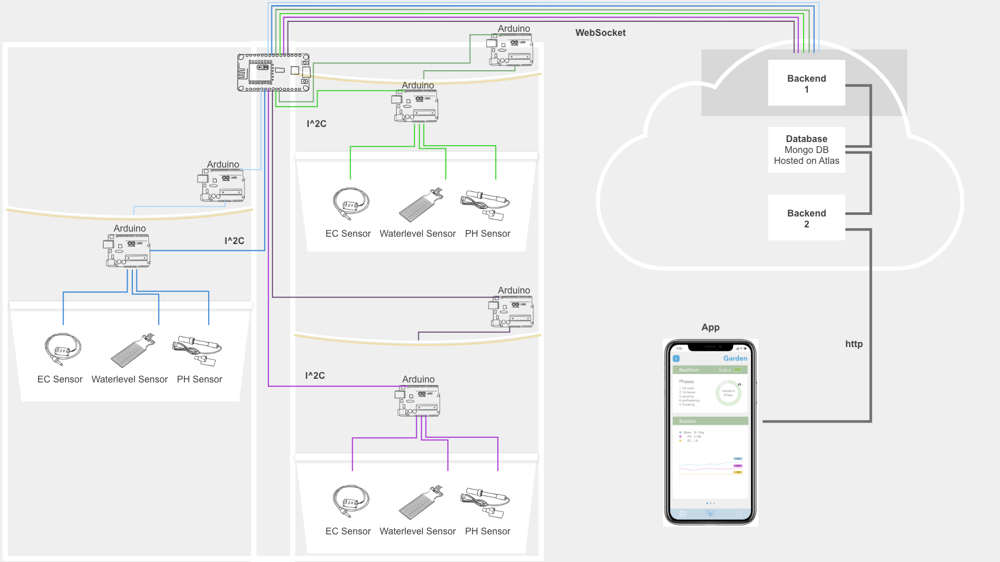

# plantarium

In unserem Projekt haben wir, innerhalb unserem Semester an der HfG Gmünd, ein automatisiertes Hydroponisches Bewässerungssysthem mit App entwickelt.
Mit diesem System kann man Pflanzen schneller großziehen und die richtigen Nährstoffe für die Pflanzen dosieren.

Der Stack besteht aus:
der mit Vue.js umgesetzten [App](https://github.com/maxicozy/plantarium-app),

einem [Backend](https://github.com/maxicozy/plantarium-backend-ii), dass die Daten aus der Datenbank für die App bereitstellt, 

einem [Backend](https://github.com/maxicozy/plantarium-backend-i), dass die Daten aus dem Hydroponischen System in die Datenbank einspeist

und aus den **Nodes** die Sensordaten sammeln und die Hardware kontrollieren.

Unser Prjektteam besteht aus:
[Noah Mantel](https://github.com/Nodarida)
[Ligia Dietze](https://github.com/Ligiki1)
[Maximilian Becht](https://github.com/maxicozy)
[Marius Schairer](https://github.com/marius220699)

## plantarium-backend-i

Das erste backend hat die Aufgabe zwischen Datenbank und Hardware zu vermitteln.

### index.js

Aktuell muss es lediglich über eine WebSocket-Verbindung die Sensordaten aus unserem Dev-Garten empfangen und diese in die auf Atlas gehostete Mongo-Datenbank einsortieren.

Das Backend schaut sich dann anhand der mitgeschickten Position des Moduls an, zu welchem Modul die Sensordaten hinzugefügt werden müssen und erstellt dann einen neuen Sensordateneintrag mit einem Timestamp.

### models

Dafür werden mit der mongoose-Library Schemas für die Gärten, Module und Sensordaten erstellt, welche jeweils über One-to-Many realtions miteinander verknüpft sind. Das heißt ein Garten kann mehrere Module haben und ein Modul kann mehrere Sensorwert-Einträge haben.

